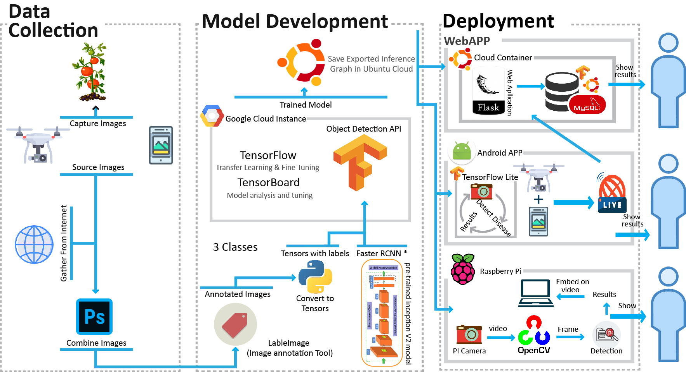

# TARP-Project
Official github repo for TARP Project 2019-20

### Dependencies
*   Python 3.6+
*   PyTorch 0.4.0
*   Pillow 5.3

### Dataset: 
PlantVillage Dataset 

[Download Here](https://www.kaggle.com/emmarex/plantdisease)

### Tasks
- [x] Deep Learning Code for Disease Detection
- [x] Drone flight control
- [x] Map Generating UI

### Project Workflow

